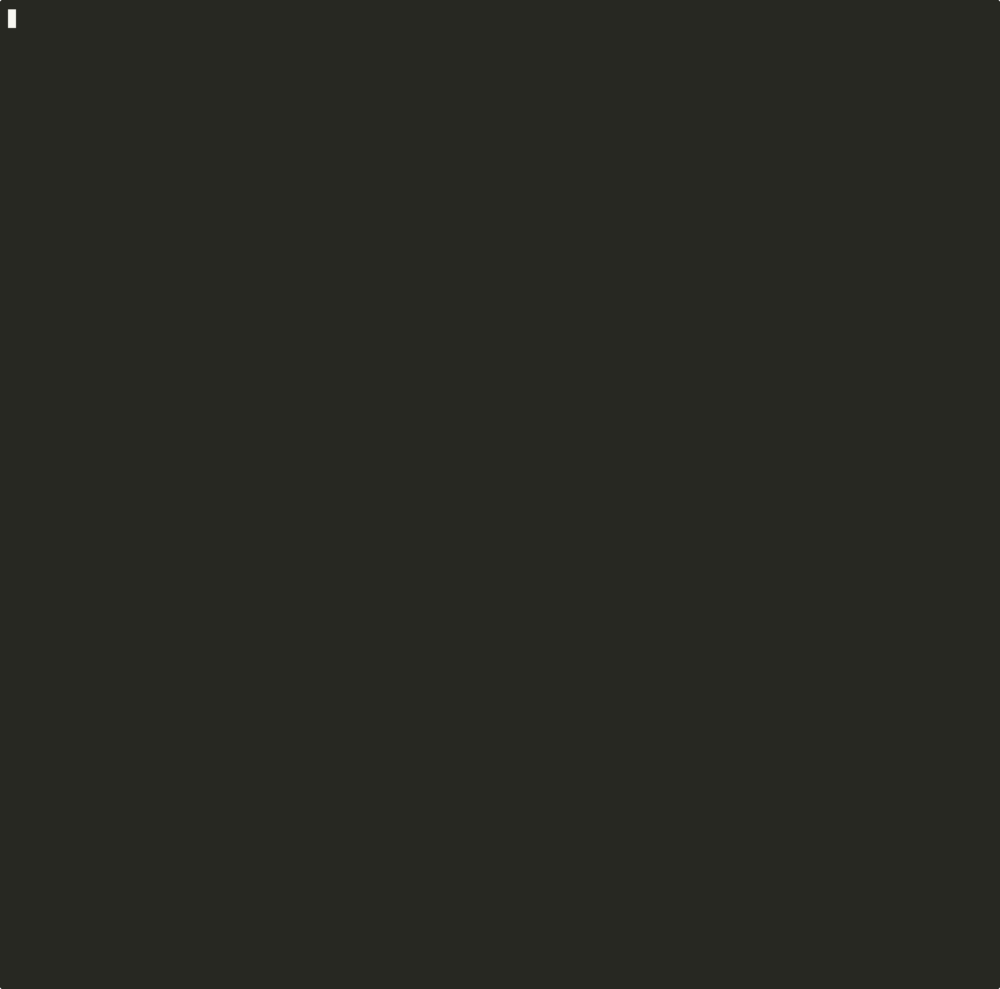

# Dazi — Develop Autonomously, Zero Interruption

Dazi is a terminal-based AI coding assistant that runs in your shell. It reads your codebase, plans changes, writes and edits files, runs commands, and manages multi-agent teams — all from a single REPL.

```
$ dazi
╭──────────────────────────────────────────╮
│  Dazi — Develop Autonomously, Zero       │
│          Interruption                    │
│  Model: gpt-4o  |  Mode: execute        │
│  DAZI.md: 2 file(s) loaded              │
╰──────────────────────────────────────────╯
>
```

## Quick Start

```bash
# Install dependencies
uv sync

# Configure API key
cp .env.example .env
# Edit .env with your OPENAI_API_KEY

# Run
uv run python -m dazi
```
## QUICK DEMO



## Architecture

Dazi is built on a LangGraph state machine with this core loop:

```
User Input → Check Compact → Call LLM → Check Permissions → Execute Tools → Output
                  ↑                                                        │
                  └──────── Background Notifications ←─────────────────────┘
```

Each turn: the LLM decides which tools to call, the permission system checks if they're allowed, tools execute (with concurrency batching), and results feed back to the LLM.

## Core Components

### Plan Mode — Think Before You Code

<!-- GIF placeholder: plan-mode.gif — Shows /plan command, read-only exploration, plan file creation, then /go to execute -->

Switch to a read-only mode where you can only explore the codebase and write a plan. No files are modified until you explicitly exit with `/go`.

```bash
> /plan
# Now in PLAN mode — only read-only tools available
> Explore the auth module and write a plan for adding OAuth support

> /go
# Now in EXECUTE mode — all tools enabled, plan is implemented
```

The plan is stored at `.dazi/plan` as markdown. In plan mode, write and destructive tools are stripped from the tool list entirely — the LLM physically cannot make changes.

| Command | Action |
|---------|--------|
| `/plan` | Enter plan mode (read-only) |
| `/go` | Exit plan mode, resume full execution |

### Tasks — Track Work With Dependencies

<!-- GIF placeholder: tasks.gif — Shows task creation, dependency setup, task board listing, and completion -->

A persistent task board for tracking multi-step work. Tasks support dependencies — a task won't start until its blockers are resolved.

```bash
> Create tasks for refactoring the auth module:
  1. "Extract token validation" (pending)
  2. "Add OAuth providers" (pending, blocked by #1)
  3. "Update tests" (pending, blocked by #2)
```

Tasks are stored as individual JSON files at `.dazi/tasks/<list_id>/<id>.json`, so a corrupted file doesn't take down the entire board.

| Command | Action |
|---------|--------|
| `/tasks` | Show task board |
| `/task <id>` | Get full task details |

### Hooks — Extend Tool Behavior

<!-- GIF placeholder: hooks.gif — Shows hook registration, tool execution with hook output, and hook listing -->

Run custom logic before or after tool execution. Hooks can modify tool inputs/outputs, override permission decisions, or block execution entirely.

**Hook events:**
- `PRE_TOOL_USE` — modify input or block before execution
- `POST_TOOL_USE` — modify output after execution
- `POST_TOOL_USE_FAILURE` — react to errors
- `USER_PROMPT_SUBMIT` — preprocess user input
- `SESSION_START` — run setup logic

Hooks are priority-ordered (lower runs first). Multiple hooks can chain, with later hooks overriding earlier ones.

| Command | Action |
|---------|--------|
| `/hooks` | List registered hooks |

### Permissions & Rules — Control What Tools Can Do

<!-- GIF placeholder: rules.gif — Shows /allow and /deny commands, rule listing, and permission prompt during tool use -->

Every tool call goes through a permission check. You control access with allow/deny rules that support exact match, prefix, wildcard, and glob patterns.

```bash
> /allow git push:*       # Allow all git push variants
> /deny rm -rf *          # Never allow recursive delete
> /allow npm:*            # Allow all npm commands
```

**Priority chain:** CLI rules > Settings rules > Default mode behavior. Within the same source, deny always wins over allow.

**Permission modes:**
- `default` — ask before destructive actions
- `plan` — read-only (no write/destructive tools)
- `acceptEdits` — auto-approve file edits, ask for shell commands
- `bypass` — allow everything

| Command | Action |
|---------|--------|
| `/rules` | List all permission rules |
| `/allow <pattern>` | Add allow rule |
| `/deny <pattern>` | Add deny rule |

### Cost Tracking — Know What You Spend

<!-- GIF placeholder: cost.gif — Shows /cost command with per-model breakdown and session totals -->

Track token usage and estimated cost for every LLM call in the session. Costs are broken down by model with input/output token counts.

```bash
> /cost

Session Cost
┏━━━━━━━━━━━┳━━━━━━━━━━┳━━━━━━━━━━━┳━━━━━━━━━━━┳━━━━━━━━━━━━━┓
┃ Model     ┃ Requests ┃ In Tokens ┃ Out Tokens┃ Cost (USD)  ┃
┡━━━━━━━━━━━╇━━━━━━━━━━╇━━━━━━━━━━━╇━━━━━━━━━━━╇━━━━━━━━━━━━━┩
│ gpt-4o    │ 12       │ 45,230    │ 8,421     │ $0.1827     │
│ gpt-4o-m… │ 3        │ 12,100    │ 2,300     │ $0.0085     │
├───────────┼──────────┼───────────┼───────────┼─────────────┤
│ Total     │ 15       │ 57,330    │ 10,721    │ $0.1912     │
└───────────┴──────────┴───────────┴───────────┴─────────────┘
```

| Command | Action |
|---------|--------|
| `/cost` | Show current session cost |
| `/cost last` | Show previous session cost |

### Background Tasks — Non-Blocking Execution

<!-- GIF placeholder: background.gif — Shows starting a long build in background, continuing work, then checking the result -->

Run long commands without blocking the conversation. Start a build, continue coding, check results when ready.

```bash
> Run "npm run build" in the background
# Task bg-001 started — you can keep working

> Check the build status
# bg-001: completed (exit code 0, 12s)

> /bg
# List all background tasks
```

Background tasks capture stdout/stderr to `.dazi/background/<task_id>.output`. Completed tasks are reported after each turn.

| Command | Action |
|---------|--------|
| `/bg` | List background tasks |
| `/bg <id>` | Check specific task output |

### Settings — Three-Layer Configuration

<!-- GIF placeholder: settings.gif — Shows /settings with source annotations, editing settings.json, and /reload -->

Configuration merges from three layers, with higher-priority layers overriding lower ones:

```
DEFAULT (hardcoded) → USER (~/.dazi/settings.json) → PROJECT (.dazi/settings.json)
```

**Merge strategy:**
- Primitives (strings, bools, ints): higher layer wins
- Lists (allow/deny rules): concatenate and deduplicate
- Dicts (env vars, MCP servers): shallow merge, higher layer wins per-key

```bash
> /settings

model: gpt-4o                  [project]
api_base_url: https://api...   [user]
auto_compact: true             [default]
max_concurrent_tools: 5        [default]
```

| Command | Action |
|---------|--------|
| `/settings` | Show all settings with source annotations |
| `/reload` | Re-read settings files without restart |

**Configurable fields:** `model`, `api_base_url`, `api_key`, `default_mode`, `allow_rules`, `deny_rules`, `env`, `auto_compact`, `auto_memory`, `max_concurrent_tools`, `mcp_servers`.

### MCP — Model Context Protocol

<!-- GIF placeholder: mcp.gif — Shows /mcp listing servers, connecting, and using an MCP tool -->

Connect external tool servers via the Model Context Protocol. MCP tools appear alongside built-in tools and can be used by the LLM like any other tool.

```bash
> /mcp

MCP Servers
┏━━━━━━━━━━━━┳━━━━━━━━━━━━━┳━━━━━━━━━┳━━━━━━━━━━━━━━━━━━━━━━━━━━━━━━━┓
┃ Server     ┃ Status      ┃ Tools   ┃ Command                        ┃
┡━━━━━━━━━━━━╇━━━━━━━━━━━━━╇━━━━━━━━━╇━━━━━━━━━━━━━━━━━━━━━━━━━━━━━━━┩
│ filesystem │ connected   │ 4       │ npx @anthropic/mcp-fs          │
│ github     │ connected   │ 6       │ npx @anthropic/mcp-github      │
│ database   │ disconnected│ —       │ python mcp_db.py               │
└────────────┴─────────────┴─────────┴───────────────────────────────┘
```

MCP tools are namespaced as `mcp__<server>__<tool>`. Read-only MCP tools are available in plan mode.

Configure servers in `settings.json`:
```json
{
  "mcpServers": {
    "filesystem": {
      "command": "npx",
      "args": ["@anthropic/mcp-fs"],
      "env": {}
    }
  }
}
```

| Command | Action |
|---------|--------|
| `/mcp` | List MCP servers and status |
| `/mcp <name>` | Show server details |
| `/mcp connect <name>` | Connect to server |
| `/mcp disconnect <name>` | Disconnect server |

### Skills — Reusable Prompt Templates

<!-- GIF placeholder: skills.gif — Shows /skills listing, invoking /commit, and the generated commit message -->

Skills are prompt templates stored as markdown files with YAML frontmatter. They turn complex multi-step workflows into single commands.

```bash
> /commit

# The /commit skill:
# 1. Runs git status and git diff
# 2. Analyzes changes
# 3. Generates a conventional commit message
# 4. Shows the commit for your approval
```

Skills are discovered from three locations:
- **Bundled:** Built-in skills (`/commit`, `/review`, `/explain`, `/summarize`)
- **User-level:** `~/.dazi/skills/*.md` — available in all projects
- **Project-level:** `.dazi/skills/*.md` — project-specific workflows

Create a custom skill by writing a markdown file:
```markdown
---
name: deploy
description: Deploy to staging
arguments:
  - environment
---

Deploy the current branch to $environment:
1. Run tests with `npm test`
2. Build with `npm run build`
3. Deploy using `deploy --env $environment`
```

| Command | Action |
|---------|--------|
| `/skills` | List all available skills |
| `/skill <name>` | Show skill details |
| `/<name>` | Invoke a user-invocable skill |

### Agent Teams — Multi-Agent Collaboration

<!-- GIF placeholder: teams.gif — Shows /team create, spawning teammates, task assignment, and coordinated work -->

Coordinate multiple AI agents working in parallel on a shared codebase. Each team has a shared task board, inter-agent messaging, and a team lead that coordinates work.

```bash
> Create a team "refactor" with 3 agents:
  - "researcher" explores the codebase
  - "writer" makes the changes
  - "tester" runs tests

> Assign tasks to the team and let them coordinate
```

**Team architecture:**
- **Team lead:** You (or the main agent) — assigns tasks, reviews work
- **Teammates:** Sub-agents that claim tasks from the board
- **Task board:** Shared `.dazi/tasks/<team>/` with dependency tracking
- **Mailbox:** File-based inter-agent messaging at `.dazi/teams/<team>/inboxes/`

**Spawn autonomous teammates** that scan the task board, claim available work, execute it, and report back — all without manual coordination.

| Command | Action |
|---------|--------|
| `/teams` | List all teams |
| `/team <name>` | Switch to team context |
| `/team create <name>` | Create new team |
| `/team delete <name>` | Delete team |
| `/inbox` | Check your messages |
| `/send <agent> <msg>` | Send direct message |
| `/broadcast <msg>` | Message all teammates |

### Subagents — Delegate Isolated Tasks

<!-- GIF placeholder: subagents.gif — Shows delegating a research task, agent working independently, and returning results -->

Spawn a sub-agent with a fresh context window to handle a specific task. The sub-agent has no knowledge of the parent conversation — you provide all context in the task description.

```bash
> Delegate "Research the best caching strategy for our API endpoints"
  to a sub-agent with max 10 turns
```

Sub-agents can be scoped to specific tools, preventing them from accessing tools outside their remit.

### Worktrees — Isolated Working Directories

<!-- GIF placeholder: worktree.gif — Shows creating a worktree, parallel agents working without conflicts, and merging results -->

Git worktrees give each agent its own checkout on its own branch. Multiple agents can edit the same files simultaneously without merge conflicts.

```bash
> Create worktree "feature-auth"
# Working in .dazi/worktrees/feature-auth/ on branch agent-feature-auth

> (agent works independently)

> Finish worktree "feature-auth" — keep
# Branch preserved, worktree cleaned up
```

### Memory — Persistent Knowledge Across Sessions

<!-- GIF placeholder: memory.gif — Shows /remember saving context, /memories listing, and memory auto-injection in a new session -->

Store important context that persists across conversations. Memories are automatically injected into the system prompt when relevant.

```bash
> /remember This project uses Python 3.12+ with uv for package management

# In a future session:
> How should I install dependencies?
# Dazi knows to use `uv` because of the stored memory
```

**Memory types:**
- `user` — Your role, preferences, expertise
- `feedback` — Guidance on how to approach work
- `project` — Ongoing initiatives, deadlines, decisions
- `reference` — Pointers to external resources (dashboards, trackers)

Memories are stored as individual `.md` files in the memory directory with YAML frontmatter. An index file (`MEMORY.md`) enables fast lookup.

| Command | Action |
|---------|--------|
| `/remember <text>` | Save a memory |
| `/forget <id>` | Delete a memory |
| `/memories` | List all memories |
| `/reindex` | Rebuild memory index |

### Context Compaction — Unlimited Conversation Length

<!-- GIF placeholder: compact.gif — Shows token usage growing, auto-compact triggering, and conversation continuing seamlessly -->

Conversations can grow beyond the context window. Dazi automatically compresses old messages when approaching the limit, keeping recent context intact.

**Two compaction strategies:**
- **Micro-compact:** Replace old tool results with compact markers (fast, no LLM call)
- **Full compact:** Use the LLM to summarize old messages (slower, preserves intent)

```bash
> /tokens
# Tokens: 98,421 / 128,000 (77%) — 29,579 remaining

> /compact
# Compressed 45 messages → 12-message summary
```

A circuit breaker stops compaction after 3 consecutive failures to prevent loops.

| Command | Action |
|---------|--------|
| `/compact` | Manual full compact |
| `/tokens` | Show token usage and context window |

### Proactive Mode — Autonomous Background Operation

<!-- GIF placeholder: proactive.gif — Shows /proactive on, agent working autonomously with tick messages, and pause/resume -->

Enable autonomous operation where Dazi stays active between your inputs, monitoring background tasks and taking initiative.

```bash
> /proactive on
# Dazi is now active — it will monitor and act autonomously

# Ctrl+C to pause, type anything to resume

> /proactive off
```

### DAZI.md — Project-Level Instructions

<!-- GIF placeholder: dazimd.gif — Shows DAZI.md file being loaded, its content displayed, and instructions affecting agent behavior -->

DAZI.md files provide project-specific instructions that shape Dazi's behavior. They're loaded hierarchically and injected into the system prompt.

**Loading priority (highest to lowest):**
1. `DAZI.local.md` — project root, gitignored (private per-project)
2. `DAZI.md` — project root (shared with team, checked into git)
3. `~/.dazi/DAZI.md` — user global (applies to all projects)

```markdown
<!-- DAZI.md -->
## Project Rules
- Always use Python 3.12+ features
- Follow PEP 8 strictly
- Use pytest for testing
- Run `uv run pytest` before committing
```

DAZI.md supports `@include` directives for composing from multiple files:
```markdown
@include .dazi/rules/coding-style.md
@include .dazi/rules/testing.md
```

| Command | Action |
|---------|--------|
| `/dazimd` | Show loaded DAZI.md files and their content |

## Full Command Reference

| Command | Description |
|---------|-------------|
| `/plan` | Enter plan mode (read-only) |
| `/go` | Exit plan mode, resume execution |
| `/tools` | List available tools |
| `/tasks` | Show task board |
| `/task <id>` | Get task details |
| `/skills` | List skills |
| `/skill <name>` | Show skill details |
| `/<skill>` | Invoke a user-invocable skill |
| `/mcp` | Show MCP servers |
| `/cost` | Show session cost |
| `/cost last` | Show previous session cost |
| `/settings` | Show settings with sources |
| `/rules` | List permission rules |
| `/allow <pattern>` | Add allow rule |
| `/deny <pattern>` | Add deny rule |
| `/hooks` | List registered hooks |
| `/compact` | Compress conversation context |
| `/tokens` | Show token usage |
| `/remember <text>` | Save a memory |
| `/forget <id>` | Delete a memory |
| `/memories` | List memories |
| `/reindex` | Rebuild memory index |
| `/dazimd` | Show loaded DAZI.md files |
| `/bg` | List background tasks |
| `/bg <id>` | Check background task |
| `/teams` | List teams |
| `/team <name>` | Switch to team |
| `/team create <name>` | Create team |
| `/team delete <name>` | Delete team |
| `/inbox` | Check messages |
| `/send <agent> <msg>` | Send message |
| `/broadcast <msg>` | Message all |
| `/proactive` | Show proactive status |
| `/proactive on` | Enable proactive mode |
| `/proactive off` | Disable proactive mode |
| `/worktree` | List worktrees |
| `/worktree create <name>` | Create worktree |
| `/worktree finish <name>` | Finish worktree |
| `/reload` | Reload settings and DAZI.md |
| `/clear` | Reset conversation |
| `/quit` | Exit Dazi |

## Environment Variables

| Variable | Description |
|----------|-------------|
| `OPENAI_API_KEY` | API key for the LLM provider |
| `OPENAI_MODEL` | Default model name (overridden by settings) |
| `OPENAI_BASE_URL` | Custom API endpoint (overridden by settings) |
| `DAZI_MAX_CONCURRENT` | Max parallel tool executions (default: 5) |
| `DAZI_PROACTIVE` | Set to `1` to enable proactive mode at startup |

## Configuration

Settings are stored in JSON with three layers:

**`~/.dazi/settings.json`** (user-level, all projects):
```json
{
  "model": "gpt-4o",
  "api_base_url": "https://api.openai.com/v1",
  "max_concurrent_tools": 5,
  "mcpServers": {
    "filesystem": {
      "command": "npx",
      "args": ["@anthropic/mcp-fs"]
    }
  }
}
```

**`.dazi/settings.json`** (project-level, shared with team):
```json
{
  "allow_rules": ["git status", "npm test"],
  "deny_rules": ["rm -rf *"],
  "env": {
    "NODE_ENV": "test"
  }
}
```

---

## Preparing Demo GIFs

Each component section above has a `<!-- GIF placeholder -->` comment marking where a demo GIF should go. Here's how to prepare them:

### Recommended Workflow

1. **Record with terminal emulators** that support GIF export:
   - **macOS:** Use [ttygif](https://github.com/icholy/ttygif) + [ttyrec](https://opensource.apple.com/source/telnet/telnet-13/telnet/ttyrec.h)
     ```bash
     # Record terminal session
     ttyrec my-recording

     # Convert to GIF
     ttygif my-recording -o plan-mode.gif
     ```
   - Or use **macOS Screen Recording** (Cmd+Shift+5) then convert with `ffmpeg`:
     ```bash
     ffmpeg -i recording.mov -vf "fps=15,scale=800:-1:flags=lanczos" -loop 0 plan-mode.gif
     ```
   - **Alternative:** [asciinema](https://asciinema.org) for recording, then [agg](https://github.com/asciinema/agg) for GIF conversion:
     ```bash
     asciinema rec plan-mode.cast
     agg --theme monokai --font-size 14 plan-mode.cast plan-mode.gif
     ```

2. **Keep GIFs small:**
   - Target **5–15 seconds**, max 30 seconds
   - Use a **narrow terminal** (80–100 columns, ~20 rows) — this renders well on GitHub
   - Aim for **under 2MB** per GIF for fast loading
   - Use `gifsicle` to optimize:
     ```bash
     gifsicle -O3 --colors 128 -o plan-mode.gif plan-mode-raw.gif
     ```

3. **File naming and placement:**
   - Store GIFs in `docs/gifs/` directory
   - Name to match the placeholder: `plan-mode.gif`, `tasks.gif`, `rules.gif`, etc.
   - Replace the `<!-- GIF placeholder -->` comments with:
     ```markdown
     
     ```

### GIF Checklist

Prepare one GIF per component. For each, focus on the **core user action** — show the command being typed and the result:

| GIF File | What to Show | Duration Target |
|----------|-------------|-----------------|
| `plan-mode.gif` | Type `/plan`, explore codebase read-only, type `/go` | 10–15s |
| `tasks.gif` | Create tasks, set dependencies, `/tasks` board, complete | 10–15s |
| `rules.gif` | `/allow`, `/deny`, `/rules` listing, permission prompt in action | 8–12s |
| `cost.gif` | `/cost` showing per-model breakdown and totals | 5–8s |
| `background.gif` | Start long command in background, continue work, check result | 10–15s |
| `settings.gif` | `/settings` with source annotations, edit file, `/reload` | 8–12s |
| `mcp.gif` | `/mcp` listing, connect server, use MCP tool | 10–15s |
| `skills.gif` | `/skills` listing, invoke `/commit`, show generated result | 8–12s |
| `teams.gif` | `/team create`, spawn teammates, task assignment, coordinated work | 15–20s |
| `subagents.gif` | `delegate_task`, agent working, returning summary | 10–15s |
| `worktree.gif` | Create worktree, parallel agent work, finish worktree | 10–15s |
| `memory.gif` | `/remember`, `/memories`, new session auto-injecting memory | 10–12s |
| `compact.gif` | `/tokens` showing high usage, `/compact`, conversation continues | 8–12s |
| `proactive.gif` | `/proactive on`, agent acting autonomously, pause/resume | 10–15s |
| `dazimd.gif` | Show DAZI.md file, `/dazimd` loading it, behavior affected | 8–10s |

### Tips for Clean Recordings

- Use a **dark terminal theme** with good contrast (e.g., Monokai, Dracula)
- Set font size to **14–16pt** so text is readable at reduced GIF dimensions
- Disable terminal prompts or set `PS1="$ "` for minimal distraction
- Type commands deliberately — use `pv -qL 30` to replay typed input at readable speed
- Remove any API keys or sensitive data before recording
- Trim leading/trailing silence with `gifsicle -U input.gif -o output.gif`
